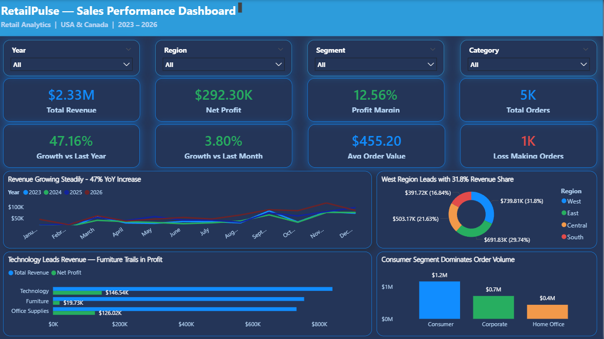
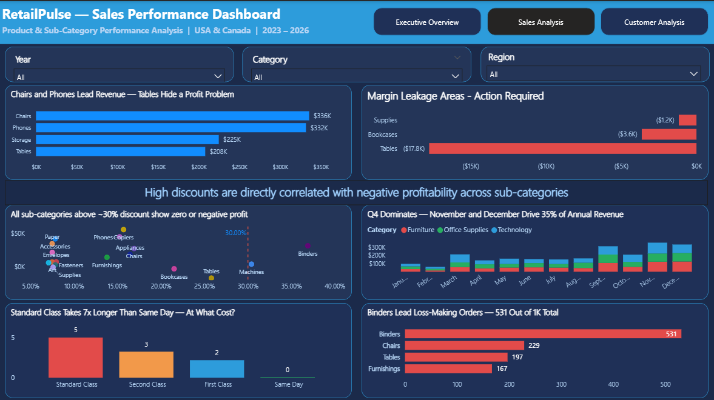
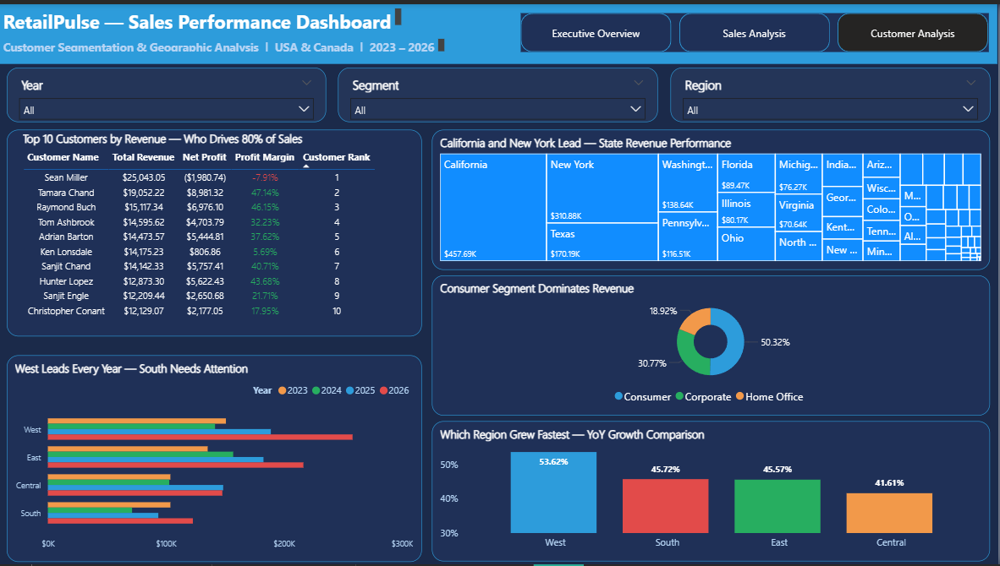

# RetailPulse — Retail Sales & Customer Analytics Dashboard

This project is an end-to-end Power BI analysis of a retail dataset (USA + Canada) to understand how revenue, profit, customers, and operations are actually performing.

The goal wasn’t just to build a dashboard, but to answer a simple question:
**“Are we actually making money where we think we are?”**

---

## Business Context

The company is seeing strong revenue growth (~47% YoY), but there’s no clear visibility into profitability at a detailed level.

Some important things were unclear:

* Are discounts hurting profit?
* Are high-revenue customers actually profitable?
* Which categories are silently making losses?
* Is growth consistent across regions?

---

## Key Questions I Focused On

* Is the growth profitable or just top-line inflation?
* Which products/categories are loss-making?
* How does discounting impact profit?
* Are any top customers unprofitable?
* Where is revenue concentrated geographically?
* Are delivery timelines impacting operations?

---

## Dataset

* ~10K transaction records
* Covers 2023–2026
* USA (major states) + small portion from Canada
* Order-level data (multiple products per order)

Some assumptions:

* No returns data available
* Negative profit values treated as actual losses
* Canada data kept as valid (not removed)

---

## What I Did

* Cleaned and prepared the dataset using Power Query
* Built a proper data model (instead of using a flat table)
* Created key DAX measures for revenue, profit, margins, growth, etc.
* Added a calculated column for delivery time
* Designed a 3-page dashboard focusing on business use, not just visuals

---

## Key Findings

* Around **20% of orders are loss-making**, contributing ~$472K in negative profit
* The **top revenue customer is actually unprofitable** (-7.9% margin)
* **Furniture category has very low margins (~2.6%)**, and some sub-categories are in loss
* Revenue is growing well overall, but **not evenly across regions**
* A large chunk of revenue is concentrated in a few states (California, New York, Texas)
* Delivery times for Standard shipping go up to **11 days**, which is concerning

---

## What I Would Recommend

* Put a cap on heavy discounting (especially above ~30%)
* Identify and review low-margin customers
* Revisit pricing strategy for Furniture (especially Tables)
* Focus more on underperforming regions like the South
* Reduce dependency on a few high-revenue states
* Look into delivery delays and logistics issues

---

## Dashboard

### Executive Overview

### Sales & Product Analysis

### Customer & Geographic Analysis

---

## Tools Used

* Power BI
* Power Query
* DAX
* Excel

---

## About Me

Dera Venkata Sai Vinay
LinkedIn: (https://www.linkedin.com/in/dera-venkata-sai-vinay/)

---

This project helped me understand how **revenue alone can be misleading**, and how digging into profit and customer-level data gives a much clearer picture of business health.
